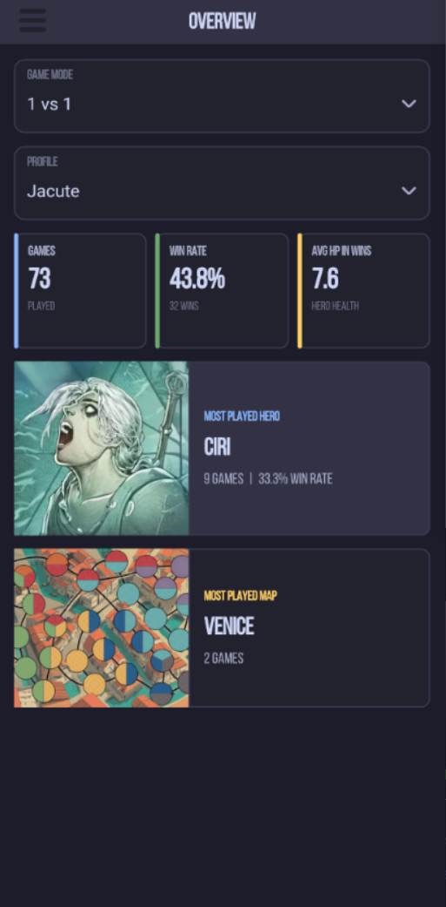

<p align="center">
    <h1 align="center">
         Unmatched Tracker
    </h1>
</p>
<p align="center">
    <strong>
		Unofficial Android companion app for the Unmatched board
		game.
    </strong>
</p>
<p align="center">
    <a href="#installation">Installation</a> •
    <a href="#development">Development</a>
</p>
<p align="center">
    <a href="https://github.com/Jacute/unmatched-tracker/actions/workflows/android.yml">
        
    </a>
    <a href="https://github.com/Jacute/unmatched-tracker/releases">
        
    </a>
</p>

Unmatched Tracker is an unofficial Android companion app for the Unmatched board
game. It helps players choose a matchup, record completed games, and view
statistics for local player profiles.

The project is in an early stage of development. 

## Features

- Browse sets, heroes, abilities, sidekicks, and cards.
- Randomize heroes and maps with filters for selected sets.
- Save a randomized matchup directly to the game history form.
- Create local player profiles and select a default profile for stats.
- Record games in `1v1`, `1v1v1`, `1v1v1v1`, and `2v2` modes.
- Store game records of played matchups.
- View profile statistics filtered by game mode.

## Screenshots



## Installation

### System requirements

- Android 13+

### Release APK

Android packages produced for tagged releases are attached here:

1. Open the [latest release](https://github.com/Jacute/unmatched-tracker/releases/latest).
2. Download the `.apk` file for `arm64-v8a` devices.
3. Allow installation from the browser or file manager when Android asks for
   permission.
4. Open the downloaded APK and confirm the installation.

Only `arm64-v8a` packages are currently produced by CI. If there is no published
release yet, development APKs are available as artifacts from successful
[Android build workflow](https://github.com/Jacute/unmatched-tracker/actions/workflows/android.yml)
runs.

## Data And Network

Player profiles, game records, statistics, and randomizer settings are currently
stored **locally on the device**. The application does not yet synchronize this data
with a server (but this is planned for the future).

Hero, card, set, and map images are downloaded when first needed and then cached
on the device. An internet connection may therefore be required when opening an
image for the first time.

Use **Settings > Database backup > Export** to save a copy of `app.db`. Removing
the application or clearing its storage can delete local data, so export the
database before doing either operation.

## Development

### Technology

- C++ and Qt 6.11
- Qt Quick and QML for the user interface
- SQLite through Qt SQL for local storage
- CMake and Ninja for the native build
- Gradle and Android SDK tools for APK/AAB packaging

### Project Structure

| Path | Purpose |
| --- | --- |
| `ui/` | QML pages, reusable components, and bundled UI assets |
| `src/core/` | Operations exposed by C++ to QML |
| `src/db/` | SQLite access and migration runner |
| `src/files/` | Image download and local cache handling |
| `src/api/` | HTTP client for server |
| `src/migrations/` | Ordered SQLite schema and data migrations |
| `android/` | Android package resources and launcher icons |
| `.github/workflows/` | Android build and migration checks |

At runtime, QML calls the `Core` object registered in `src/main.cpp`. `Core`
coordinates database operations and image loading while keeping SQL and file
handling outside the UI layer.

### Prerequisites

The versions below match the Android CI configuration:

- Qt `6.11.0` with a desktop host installation and the Android `arm64-v8a` kit
- CMake `3.16` or newer
- Ninja
- Java 17
- Android SDK command-line tools and platform tools
- Android SDK platform 36 and build tools `36.0.0`
- Android NDK `27.2.12479018`
- An Android device or emulator for installation

Using prebuilt Qt packages is the quickest setup. Building Qt from source is not
required for normal development. When diagnosing a local toolchain difference,
compare it with `.github/workflows/android.yml`, which is the source of truth for
the CI environment.

### Environment

Adjust these paths for the local Qt and Android SDK installations:

```bash
export QT_CMAKE="$HOME/Qt/6.11.0/android_arm64_v8a/bin/qt-cmake"
export ANDROID_SDK_ROOT="$HOME/Android/Sdk"
export ANDROID_NDK_ROOT="$ANDROID_SDK_ROOT/ndk/27.2.12479018"
```

### Debug Build

Configure a clean debug build:

```bash
"$QT_CMAKE" \
  -S . \
  -B build \
  -GNinja \
  -DCMAKE_BUILD_TYPE=Debug \
  -DANDROID_SDK_ROOT="$ANDROID_SDK_ROOT" \
  -DANDROID_NDK_ROOT="$ANDROID_NDK_ROOT" \
  -DANDROID_ABI=arm64-v8a \
  -DANDROID_PLATFORM=android-33 \
  -DPACKAGE_NAME=com.jacute.unmatched_tracker \
  -DAPI_URL="${API_URL:-}"
```

Build the APK:

```bash
cmake --build build --target apk --parallel
```

The debug package is normally created at:

```text
build/android-build/build/outputs/apk/debug/android-build-debug.apk
```

Install it with:

```bash
adb install -r build/android-build/build/outputs/apk/debug/android-build-debug.apk
```

The repository `Makefile` provides shortcuts after CMake has configured the
`build` directory:

```bash
make
make install
```

### Signed Release Build

Keep signing credentials outside the repository. Export them in the same shell
that will run the build:

```bash
export QT_ANDROID_KEYSTORE_PATH="/path/to/upload.keystore"
export QT_ANDROID_KEYSTORE_ALIAS="upload"

read -rsp "Keystore password: " QT_ANDROID_KEYSTORE_STORE_PASS
printf '\n'
export QT_ANDROID_KEYSTORE_STORE_PASS

read -rsp "Key password: " QT_ANDROID_KEYSTORE_KEY_PASS
printf '\n'
export QT_ANDROID_KEYSTORE_KEY_PASS
```

Use a separate build directory so debug and release configuration do not share
the same CMake cache:

```bash
"$QT_CMAKE" \
  -S . \
  -B build-release \
  -GNinja \
  -DCMAKE_BUILD_TYPE=Release \
  -DANDROID_SDK_ROOT="$ANDROID_SDK_ROOT" \
  -DANDROID_NDK_ROOT="$ANDROID_NDK_ROOT" \
  -DANDROID_ABI=arm64-v8a \
  -DANDROID_PLATFORM=android-33 \
  -DPACKAGE_NAME=com.jacute.unmatched_tracker \
  -DAPI_URL="${API_URL:-}" \
  -DQT_ANDROID_SIGN_APK=ON \
  -DQT_ANDROID_SIGN_AAB=ON

cmake --build build-release --target apk --parallel
cmake --build build-release --target aab --parallel
```

Generated packages can be found with:

```bash
find build-release/android-build/build/outputs \
  -type f \( -name '*.apk' -o -name '*.aab' \)
```

## Database Migrations

Migration files are stored in `src/migrations/` and applied in the order listed
in `src/config.json`.

When changing the database schema:

1. Add the next numbered `*.up.sql` file.
2. Add its Qt resource path to `db.migrations` in `src/config.json`.
3. Do not depend on editing a migration that may already have been applied to a
   user's database. Add a new migration for subsequent schema changes.
4. Run the migration check against a clean database.

The `SQLite migrations` workflow verifies that every migration is registered,
applies all files to a clean SQLite database, and runs foreign-key and integrity
checks. It runs for every pushed branch and pull request.

For a local check, install `jq` and `sqlite3`, then run the same commands from
`.github/workflows/migrations.yml`.

## Contributing

Contributions and bug reports are welcome.

1. Fork the repository and create a focused branch.
2. Keep changes consistent with the existing C++ and QML architecture.
3. Add new QML files and resources to `CMakeLists.txt` when required.
4. Format changed C++ files according to `.clang-format`.
5. Build a debug APK and run the migration check when database files change.
6. Open a pull request describing the behavior, implementation, and manual test
   performed.

If this is your first time contributing to a project, you can check out the issues tagged *good first issue*.

Avoid committing build directories, Android signing files, passwords, API keys or exported databases.

## Known Limitations

- Official CI currently builds only for Android `arm64-v8a`.
- Images require network access before they have been cached.
- Profiles and game records are local-only; server synchronization is planned.
- Automated unit tests have not been added yet. CI currently validates Android packaging and SQLite migrations.
